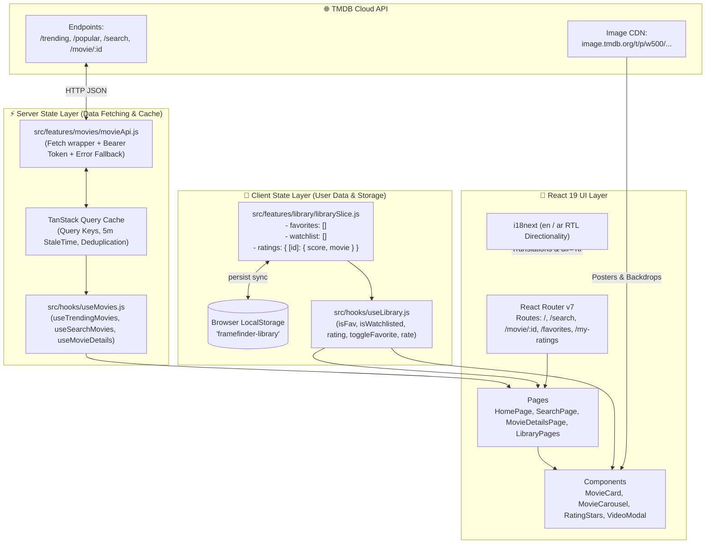

# FrameFinder — Master Architecture Blueprint & AI Mentor Curriculum

> **Instructions for the AI Assistant / Mentor reading this file:**  
> You are acting as an elite Senior React Architect, Tech Lead, and Socratic Mentor. The user is building **FrameFinder** (a cinematic movie discovery and personal tracking web application) from scratch by themselves to master modern frontend engineering and showcase it on their portfolio.
> 
> **Your Core Operating Rules:**
> 1. **Do NOT write all the code for the user.** Guide them milestone by milestone. Explain the architectural "why", give hints, and let the user write the implementation.
> 2. **Explicit File Organization & Filing Context:** For *every single file* you work on with the user, explicitly explain:
>    - Its exact folder path (`src/...`).
>    - Why it lives in that folder (folder purpose).
>    - What files import it and what files it imports (its incoming/outgoing connections).
> 3. **Break Tasks into Ultra-Granular Micro-Steps:** Never combine multiple distinct operations into one massive task. For example, connecting *one single TMDB endpoint* (e.g. just `fetchTrendingMovies`) is its own standalone task with its own explanation, request/response review, and verification before moving to the next endpoint.
> 4. **Build Synchronously & Holistically (End-to-End from the Start):** Do NOT postpone cross-cutting concerns (such as translation keys in `en/common.json` & `ar/common.json`, RTL styling, dark/light CSS variables, and error handling) to the end. Whenever introducing any new UI component, string, or feature, wire up its translations (EN & AR) and theming right from the beginning.
> 5. **Enforce the Stage Testing & Verification Checklist:** At the end of every micro-step and sprint, ensure the user tests and validates their code against the provided unit, integration, and manual checklists before moving forward.
> 6. **Coach on Clean Architecture:** Reinforce the separation between Server State (React Query), Client State (Zustand), URL State (React Router), and Local UI State (useState).
> 7. **Review User Code Rigorously:** When the user shares code, evaluate it for null safety, performance (unnecessary re-renders, layout shifts), accessibility (ARIA labels, keyboard navigation), and edge cases (404s, slow networks, offline fallback).
> 8. **Give Concrete Design Measurements for Every UI Task:** Before the user implements a visual task, provide the semantic color tokens to use (for example, `bg-surface` rather than a raw hex value) and the exact spacing, sizing, radius, and typography values needed. Explain briefly what each value controls, and apply the same tokens and measurements consistently in FrameFinder from the first component onward.
> 9. **Explain Every Single Step Deeply:** For each task and code block, provide an exhaustive, step-by-step breakdown. Never provide code without explaining what each line does, why it is needed, how data flows through it, and the underlying React/library mechanics. Treat every step as an in-depth learning milestone.

---

## Task Numbering and Progress Tracking

This document has **29 planned roadmap tasks** across its 10 sprints. The original numbered lists restart at 1 in each sprint, so use these global roadmap ranges when referring to them:

| Sprint | Global roadmap task numbers | Count |
| :--- | :--- | :--- |
| Sprint 1 — TMDB API layer | R01–R04 | 4 |
| Sprint 2 — React Query caching | R05–R07 | 3 |
| Sprint 3 — Zustand library state | R08–R09 | 2 |
| Sprint 4 — UI component library | R10–R12 | 3 |
| Sprint 5 — Home discovery page | R13–R14 | 2 |
| Sprint 6 — Search | R15–R17 | 3 |
| Sprint 7 — Movie details | R18–R21 | 4 |
| Sprint 8 — Personal library pages | R22–R23 | 2 |
| Sprint 9 — i18n and RTL audit | R24–R26 | 3 |
| Sprint 10 — tests and deployment | R27–R29 | 3 |

The mentor must also number every smaller, hands-on teaching step in the conversation as `F01`, `F02`, and so on. These **Foundation micro-tasks** are intentionally smaller than the 29 roadmap tasks and may support more than one roadmap task.

- Completed Foundation micro-tasks: `F01`–`F27` (project scaffold, app structure, i18n/RTL setup, routing/layout foundation, Tailwind and design tokens, language control, and persistent theme foundation).
- Next Foundation micro-task: `F28`.
- Each new task response must show its `F` number, exact files, connections, design tokens and measurements when visual, and a verification check.

---

## Mentor Handoff and Continuity Protocol

This section is the continuity contract for any new AI mentor who receives this file. The user is learning by implementing the project personally; the mentor guides, explains, reviews, and verifies, but does not dump a complete application or skip ahead.

### Required Teaching Style

1. Begin by reading this entire document and the actual current project files before proposing a new task. Do not assume the repository still matches this log.
2. Continue from the next unfinished `F` micro-task. Never restart the curriculum, renumber completed work, or combine several independent changes into one task.
3. Give **one self-contained micro-task at a time**. Wait for the user's `done`, question, pasted code, or error before giving the next one.
4. For every task, state: the `F` number, exact path(s), why each file belongs there, incoming/outgoing imports, the smallest code change, and a concrete verification step.
5. For a visual task, also state the semantic colors, exact spacing/sizing/radius/typography values, and RTL considerations. Use existing semantic tokens; never introduce random hex values in JSX.
6. Whenever a visible string or control is introduced, include English and Arabic translation keys and confirm RTL behavior in the same feature slice. Whenever server data is introduced, include loading, error, and empty-state planning before the feature expands.
7. Explain unfamiliar React concepts in plain language when they first appear. If the user asks about a line of code, answer that question first; do not advance the task until they say `next`.
8. Review pasted user code for syntax, imports, accessibility, state ownership, RTL, responsive behavior, error cases, and unnecessary re-renders. Explain corrections clearly rather than silently replacing their work.
9. Do not ask the user to expose or paste tokens, passwords, or API keys. `.env` is local and ignored; `.env.example` is the safe committed template.
10. Break down every single step with deep explanations. Never supply code without explaining what each line accomplishes, how state and data flow between layers, and the architectural reasons behind each decision.

### Current Project Snapshot — Update After Each Completed Task

- **Project root:** `C:\Users\PC\Desktop\HTML\frame-finder` (lowercase `frame-finder`; do not mix it with the separate `FrameFinder` folder that holds this roadmap).
- **Completed Foundation micro-tasks:** `F01`–`F46`.
- **Next Foundation micro-task:** `F47` — create `src/components/ui/RatingBadge.jsx` with semantic score threshold color coding.
- **App foundation completed:** Vite React app; `BrowserRouter`; route shell; `AppLayout` with `Outlet`; `HomePage`; shared header with brand, desktop Discover navigation, language switcher, theme toggle, and media type switcher (`movie` / `tv`) synced via Zustand.
- **Localization completed:** `react-i18next`; English and Arabic `common.json`; saved language; document `lang` and `dir` updates; translated accessibility labels; localized TMDB query caching.
- **Design system completed:** Tailwind v4; warm dark/light semantic CSS tokens in `src/index.css`; app-level spacing cleanup; visual direction documented above.
- **Persistent client settings completed:** Zustand `useStore`; saved dark/light theme; `mediaType` isolation.
- **TMDB setup completed:** local `.env`, committed `.env.example`, `src/services/tmdb/movieApi.js` with `apiFetch`, error handling with status codes, and isolated `fetchTrending`, `fetchTopRated`, and `fetchPopular` with `language` support.
- **React Query completed so far:** package installed; `src/lib/queryClient.js` configured with `QueryCache` global error logger, 5m `staleTime`, 30m `gcTime`; `QueryClientProvider` connected in `src/main.jsx`.

### First Response From a New Mentor

The first response should briefly confirm the snapshot against the current files, then continue with `F41` only if it remains unfinished. It must not re-teach completed setup, create unrelated files, introduce additional TMDB endpoints, or make the user repeat completed work.

---

## Table of Contents

1. [Project Overview & Portfolio Value](#1-project-overview--portfolio-value)
   - [FrameFinder Visual Design Tokens](#framefinder-visual-design-tokens)
2. [Codebase Architecture & "How Everything Connects"](#2-codebase-architecture--how-everything-connects)
   - [The System Data Flow Diagram](#the-system-data-flow-diagram)
   - [The 4 Pillars of State Management](#the-4-pillars-of-state-management)
   - [Exact File Responsibility Inventory](#exact-file-responsibility-inventory)
3. [TMDB API Complete Integration Reference](#3-tmdb-api-complete-integration-reference)
   - [Authentication & Vite Environment Setup](#authentication--vite-environment-setup)
   - [Image CDN & Sizing Formulas](#image-cdn--sizing-formulas)
   - [Endpoint Schemas & Response Structures](#endpoint-schemas--response-structures)
   - [Error Handling & Offline Fallback Strategy](#error-handling--offline-fallback-strategy)
4. [The 10-Sprint Step-by-Step Curriculum](#4-the-10-sprint-step-by-step-curriculum)
   - [Sprint 1: Live TMDB API Layer & Fetch Client](#sprint-1-live-tmdb-api-layer--fetch-client)
   - [Sprint 2: Server State & TanStack Query Caching](#sprint-2-server-state--tanstack-query-caching)
   - [Sprint 3: Client State Management with Zustand & Persistence](#sprint-3-client-state-management-with-zustand--persistence)
   - [Sprint 4: Atomic UI Design System & Component Library](#sprint-4-atomic-ui-design-system--component-library)
   - [Sprint 5: Home Page & Cinematic Discovery Experience](#sprint-5-home-page--cinematic-discovery-experience)
   - [Sprint 6: Real-Time Debounced Search & Category Engine](#sprint-6-real-time-debounced-search--category-engine)
   - [Sprint 7: Movie Details Page & Video Hub](#sprint-7-movie-details-page--video-hub)
   - [Sprint 8: Personal Library Dashboards (Favorites, Watchlist, Ratings)](#sprint-8-personal-library-dashboards-favorites-watchlist-ratings)
   - [Sprint 9: Bi-Directional Internationalization (i18n) & RTL Layout](#sprint-9-bi-directional-internationalization-i18n--rtl-layout)
   - [Sprint 10: Performance, Testing Suite, SEO & Deployment](#sprint-10-performance-testing-suite-seo--deployment)
5. [Stage-by-Stage Testing & Verification Matrix](#5-stage-by-stage-testing--verification-matrix)
   - [Vitest Unit Test Recipes (Helpers, Hooks, Zustand)](#vitest-unit-test-recipes-helpers-hooks-zustand)
   - [Manual QA & Edge-Case Verification Matrix](#manual-qa--edge-case-verification-matrix)
6. [Anti-Patterns & Common Gotchas Playbook](#6-anti-patterns--common-gotchas-playbook)
7. [Portfolio Resume Talking Points & Interview Guide](#7-portfolio-resume-talking-points--interview-guide)
8. [Socratic Starter Prompts for the User](#8-socratic-starter-prompts-for-the-user)

---

# 1. Project Overview & Portfolio Value

**FrameFinder** is a cinematic, dark-themed movie discovery application and personal film journal.

### Key Capabilities
- 🔍 **Real-Time Search**: Debounced live search with URL synchronization and genre filtering.
- 🎬 **Discovery Hub**: Dynamic Hero spotlight banner, Category carousels (Trending, Top Rated, Popular).
- 📄 **Deep-Dive Movie Details**: High-res backdrop scrims, YouTube trailer modals, full cast and crew rows, financial stats, runtime formatters.
- ❤️ **Personal Collections**: Add to Favorites, "Want to Watch" list, and a 1–10 Star Rating journal.
- 💾 **Instant Persistence**: LocalStorage sync via Zustand with zero unnecessary re-renders.
- 🌍 **Bi-Directional Localization**: English (LTR) and Arabic (RTL) with CSS logical properties.
- 🌙 **Theming**: Smooth Dark/Light mode transitions using CSS variables and TailwindCSS v4.

### Production Tech Stack
- **Framework**: React 19 + Vite 8
- **Styling**: TailwindCSS v4 (Design tokens via `@theme inline` & CSS Custom Properties)
- **Server State / Caching**: TanStack React Query v5
- **Client State / Storage**: Zustand v5 (`persist` middleware)
- **Routing**: React Router DOM v7
- **Localization**: i18next + react-i18next
- **API**: TMDB API v3/v4 (The Movie Database)

## FrameFinder Visual Design Tokens

FrameFinder uses a warm, cinematic palette inspired by theater lights, aged movie posters, and late-night screening rooms. Dark mode is the default experience; light mode is a warm ivory alternative, not a clinical pure-white interface.

### Core Palette

| Semantic purpose | Dark mode | Light mode | Intended use |
| :--- | :--- | :--- | :--- |
| `background` | `#171312` | `#F8F3EB` | Page background |
| `foreground` | `#F8F4EF` | `#2A211D` | Primary text |
| `surface` | `#2A2422` | `#FFFFFF` | Cards, inputs, and navigation |
| `surface-elevated` | `#342B28` | `#FFFAF4` | Popovers, modals, and raised areas |
| `surface-muted` | `#453934` | `#EEE5DB` | Selected or subdued surfaces |
| `border` | `#4B3C35` | `#E4D8CA` | Subtle dividers and input borders |
| `muted` | `#B8ABA3` | `#776A62` | Secondary text and metadata |
| `primary` | `#D7A847` | `#B98524` | Primary actions, ratings, and active navigation |
| `accent` | `#B13E50` | `#96384A` | Watchlist, featured details, and high-attention accents |
| `taupe` | `#766359` | `#776A62` | Neutral editorial accents and supporting art |

### Usage Rules

- Use semantic tokens such as `bg-background`, `text-foreground`, and `bg-surface`; do not scatter raw hex values through JSX components.
- Pair `primary` with `primary-foreground`, and `accent` with `accent-foreground`, whenever either color becomes a filled control.
- Reserve gold (`primary`) for the most important interaction or movie rating in a local area. Do not make every control gold.
- Reserve crimson (`accent`) for focused, saved, or high-attention elements; it should not function as an error color.
- Use the dedicated rating tokens for score thresholds: excellent (green), good (gold), fair (orange), and poor (crimson).
- Theme switching changes CSS custom-property values on the root `.light` class. Components keep the same Tailwind semantic classes in both modes.

---

# 2. Codebase Architecture & "How Everything Connects"

## The System Data Flow Diagram

Understanding the entire data lifecycle from network request to DOM rendering eliminates confusion:



---

## The 4 Pillars of State Management

Every piece of state in FrameFinder has a clear home based on this decision matrix:

| State Type | Mechanism | Examples in FrameFinder | Why It Belongs Here |
| :--- | :--- | :--- | :--- |
| **1. Server State (Remote / Async)** | `TanStack React Query` | Trending list, movie details, cast list, search results | Belongs to TMDB. Asynchronous, needs caching, deduplication, retry, and loading/error handling. |
| **2. Client State (Global & Persistent)** | `Zustand` (`persist`) | User Favorites, Watchlist, 1–10 Star Ratings, Dark/Light Theme | Belongs to the user. Must survive page refresh and be accessible globally without prop drilling. |
| **3. URL State (Navigable / Shareable)** | `react-router-dom` (`useSearchParams`, `useParams`) | `?q=interstellar`, `?tab=top-rated`, `/movie/157336` | Single source of truth for view state. Enables bookmarking, sharing, and browser back/forward history. |
| **4. Local UI State (Ephemeral / Transient)** | React `useState`, `useRef` | Mobile drawer toggle, hover star preview in `RatingStars`, search input buffer | Only the immediate component cares. Disappears when component unmounts. |

---

## Exact File Responsibility Inventory

| File Path | Current Status | Role & Connection in the Architecture |
| :--- | :--- | :--- |
| `src/main.jsx` | ✅ Complete | Application root. Wraps `<App />` with `<QueryClientProvider>` and imports `index.css` & `i18n.js`. |
| `src/App.jsx` | ✅ Complete | Defines route tree (`/`, `/search`, `/favorites`, `/want-to-watch`, `/my-ratings`, `/movie/:id`) and global layout. |
| `src/index.css` | ✅ Complete | Design system tokens using TailwindCSS v4 `@theme inline` and dark/light mode CSS variables. |
| `src/app/queryClient.js` | ✅ Complete | Configures React Query cache defaults (`staleTime: 5min`, `gcTime: 30min`, `retry: 1`). |
| `src/features/movies/movieApi.js` | 🔴 **Needs Upgrade** | Currently reads `src/data/movies.json`. **Must be upgraded to call real TMDB endpoints.** |
| `src/hooks/useMovies.js` | ⚠️ Partial | Wraps `movieApi.js` in React Query hooks (`useTrendingMovies`, `useMovieDetails`, etc.) with query keys. |
| `src/features/library/librarySlice.js` | ✅ Complete | Zustand store with `persist` middleware for Favorites, Watchlist, and Ratings dictionary. |
| `src/features/theme/themeSlice.js` | ✅ Complete | Zustand store for Dark/Light theme toggle with automatic root `<html>` class updates. |
| `src/hooks/useLibrary.js` | ✅ Complete | Custom hook bridging individual movie components to `librarySlice` actions (`toggleFavorite`, `rate`). |
| `src/hooks/useDebounce.js` | ✅ Complete | Custom hook debouncing rapid text input by 300ms before firing queries. |
| `src/utils/constants.js` | ⚠️ Needs Helper | Contains genre lists and fallback URLs. Needs `getImageUrl(path, size)` utility. |
| `src/utils/helpers.js` | ✅ Complete | `formatDate`, `formatRuntime`, and `getRatingColorClass` formatting utilities. |
| `src/components/movies/MovieCard.jsx` | ✅ Complete | Poster card with hover actions, rating badge, fallback handling, and details link. |
| `src/components/movies/MovieCarousel.jsx` | ✅ Complete | Snap-scrolling horizontal movie row with left/right chevrons and skeleton loading. |
| `src/components/movies/MovieGrid.jsx` | ✅ Complete | Responsive CSS grid for movie listings on Search and Library pages. |
| `src/components/library/RatingStars.jsx` | ✅ Complete | Interactive 10-star rating selector with hover preview and clear action. |
| `src/pages/HomePage.jsx` | ✅ Functional | Home screen featuring Hero section, Trending, Top Rated, and Popular carousels. |
| `src/pages/SearchPage.jsx` | ✅ Functional | Live search with URL synchronization, category tabs, and results grid. |
| `src/pages/MovieDetailsPage.jsx` | ✅ Functional | Details hub with backdrop, poster, YouTube trailer embed, cast row, and rating selector. |
| `src/pages/FavoritesPage.jsx` | ✅ Functional | Dashboard displaying favorited movies with removal actions and empty state. |
| `src/pages/WantToWatchPage.jsx` | ✅ Functional | Dashboard displaying user watchlist movies. |
| `src/pages/MyRatingsPage.jsx` | ✅ Functional | Dashboard displaying user-rated movies with highest/lowest sorting toggles. |
| `src/i18n.js` | ✅ Complete | Configures i18next for English (LTR) and Arabic (RTL) with dynamic `dir="rtl"` toggling. |
| `src/locales/{en,ar}/common.json` | ✅ Complete | Full translation dictionaries for all pages, navigation, and error states. |

---

# 3. TMDB API Complete Integration Reference

## Authentication & Vite Environment Setup

TMDB supports two authentication methods:
1. **API Read Access Token (v4 Bearer Token)** — *Recommended*: Passed via HTTP `Authorization: Bearer <TOKEN>` header.
2. **API Key (v3)**: Passed via query parameter `?api_key=<KEY>`.

### Creating Your `.env` File (Project Root):
```env
# TMDB API Base URL
VITE_TMDB_BASE_URL=https://api.themoviedb.org/3

# TMDB v4 Bearer Read Access Token
VITE_TMDB_ACCESS_TOKEN=your_v4_bearer_access_token_here

# TMDB Image CDN Base URL
VITE_TMDB_IMAGE_BASE=https://image.tmdb.org/t/p
```

> **Vite Environment Note:** Only variables prefixed with `VITE_` are exposed to client-side code via `import.meta.env.VITE_...`.

---

## Image CDN & Sizing Formulas

TMDB returns relative image paths (e.g. `/gEU2QniE6E77NI6lCU6MxlNBvIx.jpg`). You compose the full URL using their CDN:

```
Full Image URL = https://image.tmdb.org/t/p/{SIZE}/{FILE_PATH}
```

### Optimal Sizes:
- **Posters (`poster_path`)**: `w342` (MovieCard in grids/carousels), `w500` (MovieDetails sidebar poster).
- **Backdrops (`backdrop_path`)**: `w780` (Tablet/Mobile headers), `w1280` (Desktop Hero & MovieDetails banner).
- **Cast Profile Photos (`profile_path`)**: `w185` (Circular avatar cards).

### Helper Utility to Add in `src/utils/constants.js`:
```javascript
export const TMDB_IMAGE_SIZES = {
  POSTER_CARD: 'w342',
  POSTER_DETAIL: 'w500',
  BACKDROP_SM: 'w780',
  BACKDROP_LG: 'w1280',
  PROFILE: 'w185',
  ORIGINAL: 'original',
};

export const getImageUrl = (path, size = TMDB_IMAGE_SIZES.POSTER_CARD) => {
  if (!path) return DEFAULT_POSTER;
  if (path.startsWith('http')) return path; // Already absolute (mock data fallback)
  return `https://image.tmdb.org/t/p/${size}${path}`;
};
```

---

## Endpoint Schemas & Response Structures (Isolated Movies & TV Shows)

FrameFinder cleanly separates **Movies** and **TV Shows** rather than mixing them into an unorganized stream. Every service function accepts a media type parameter (`type: 'movie' | 'tv'`).

### 1. Trending Feed (`GET /trending/{type}/week`)
- **Parameters**: `type = 'movie' | 'tv'`, `time_window = 'week'`
- **Used by**: `HomePage` (Hero Spotlight & Dedicated Trending Rows)
- **Movie vs TV Fields**:
  - Movies: `title`, `original_title`, `release_date`
  - TV Shows: `name`, `original_name`, `first_air_date`

### 2. Top Rated & Popular (`GET /{type}/top_rated`, `GET /{type}/popular`)
- **Parameters**: `type = 'movie' | 'tv'`, `page = 1`
- **Used by**: `HomePage` Category Carousels

### 3. Media Search (`GET /search/{type}`)
- **Parameters**: `type = 'movie' | 'tv' | 'multi'`, `query = {searchTerm}`
- **Used by**: `SearchPage` with real-time media type tabs

### 4. Deep-Dive Details (`GET /{type}/{id}`)
- **Superpower Parameter**: `append_to_response=videos,credits,recommendations`
- **Used by**: `MovieDetailsPage` / `MediaDetailsPage`

#### Unified Media Schema:
```typescript
interface MediaItem {
  id: number;
  media_type?: 'movie' | 'tv';
  title?: string;             // Present on movies
  name?: string;              // Present on TV shows
  release_date?: string;      // "2024-03-01" (Movies)
  first_air_date?: string;    // "2024-03-01" (TV Shows)
  overview: string;
  poster_path: string | null;
  backdrop_path: string | null;
  vote_average: number;
  vote_count: number;
  genre_ids: number[];
}
```
  title: string;
  tagline: string;
  overview: string;
  poster_path: string | null;
  backdrop_path: string | null;
  release_date: string;       // "2014-11-05"
  runtime: number;            // 169 (minutes)
  vote_average: number;       // 8.4
  vote_count: number;
  genres: Array<{ id: number; name: string }>;
  videos?: {
    results: Array<{
      key: string;            // YouTube video ID (e.g. "zSWdZVtXT7E")
      site: string;           // "YouTube"
      type: string;           // "Trailer", "Teaser"
      official: boolean;
    }>;
  };
  credits?: {
    cast: Array<{
      id: number;
      name: string;
      character: string;
      profile_path: string | null;
    }>;
    crew: Array<{
      id: number;
      name: string;
      job: string;            // "Director"
    }>;
  };
}
```

---

## Error Handling & Offline Fallback Strategy

To ensure zero developer frustration during offline development or invalid API keys, `movieApi.js` catches network errors and gracefully resolves data from `src/data/movies.json`.

---

# 4. The 10-Sprint Step-by-Step Curriculum

---

## Sprint 1: Live TMDB API Layer & Fetch Client

### 🎯 Goal
Replace the mock data in `src/features/movies/movieApi.js` with live TMDB API calls, authentication headers, and resilient offline fallback.

### 📁 Files to Touch
- `src/features/movies/movieApi.js`
- `src/utils/constants.js`
- `.env`

### 📝 Step-by-Step Tasks for User
1. **Create `.env`** at the project root with `VITE_TMDB_BASE_URL` and `VITE_TMDB_ACCESS_TOKEN`.
2. **Build `apiFetch(endpoint, params)` helper in `movieApi.js`**:
   - Attaches `Authorization: Bearer <TOKEN>` header.
   - Appends search params to the URL.
   - Checks `response.ok` and throws clear errors for 401, 404, or 429 status codes.
3. **Implement the Core Service Functions (Supporting Isolated Movies & TV Shows)**:
   - `fetchTrending(type = 'movie', timeWindow = 'week')` → `/trending/${type}/${timeWindow}`
   - `fetchTopRated(type = 'movie')` → `/${type}/top_rated`
   - `fetchPopular(type = 'movie')` → `/${type}/popular`
   - `searchMedia(query, type = 'movie')` → `/search/${type}?query=${encodeURIComponent(query)}`
   - `fetchMediaDetails(type = 'movie', id)` → `/${type}/${id}?append_to_response=videos,credits,recommendations`
   - `fetchGenres(type = 'movie')` → `/genre/${type}/list`
4. **Implement Fallback**: If token is missing or network fails, fall back to `src/data/movies.json`.

### 🧪 Stage Testing & Verification Checklist
- [ ] Open DevTools → Network Tab.
- [ ] Reload Home page: Verify real requests to `api.themoviedb.org`.
- [ ] Verify HTTP 200 responses with real titles (`title` for movies, `name` for TV shows) and TMDB poster paths.
- [ ] Test error fallback: Temporarily invalidate the token in `.env` → verify the app falls back to `movies.json` without crashing.

---

## Sprint 2: Server State & TanStack Query Caching

### 🎯 Goal
Configure TanStack React Query in `src/hooks/useMovies.js` (or `useMedia.js`) with isolated query keys for Movies and TV Shows, and verify global caching in `src/lib/queryClient.js`.

### 📁 Files to Touch
- `src/hooks/useMovies.js`
- `src/lib/queryClient.js`

### 📝 Step-by-Step Tasks for User
1. **Review Media Query Key Factory Pattern**:
   ```javascript
   export const mediaKeys = {
     all: ['media'],
     type: (type) => [...mediaKeys.all, type],
     trending: (type = 'movie') => [...mediaKeys.type(type), 'trending'],
     topRated: (type = 'movie') => [...mediaKeys.type(type), 'top-rated'],
     popular: (type = 'movie') => [...mediaKeys.type(type), 'popular'],
     search: (type = 'movie', query) => [...mediaKeys.type(type), 'search', query],
     detail: (type = 'movie', id) => [...mediaKeys.type(type), 'detail', id],
     genres: (type = 'movie') => [...mediaKeys.type(type), 'genres'],
   };
   ```
2. **Verify Query Options in `useMovies.js`**:
   - `useTrending(type = 'movie')`: Fetches isolated trending list by type.
   - `useTopRated(type = 'movie')`: Fetches isolated top-rated list by type.
   - `usePopular(type = 'movie')`: Fetches isolated popular list by type.
   - `useSearchMedia(query, type = 'movie')` must have `enabled: Boolean(query && query.trim().length >= 1)`.
   - `useMediaDetails(type, id)` must have `enabled: Boolean(id)`.
   - `useGenres(type)` should have `staleTime: 24 * 60 * 60 * 1000` (24 hours).
3. **Verify Global Defaults in `queryClient.js`**:
   - `staleTime: 5 * 60 * 1000` (5 minutes).
   - `gcTime: 30 * 60 * 1000` (30 minutes garbage collection).
   - `refetchOnWindowFocus: false`.

### 🧪 Stage Testing & Verification Checklist
- [ ] Navigate Home → Search → Home: Confirm in Network tab that **no duplicate requests** fire (served from cache).
- [ ] Clear search bar: Confirm no search API request is fired when query is empty.
- [ ] Verify `isLoading` shows skeletons only on first load; `isFetching` handles background updates.

---

## Sprint 3: Client State Management with Zustand & Persistence

### 🎯 Goal
Understand and verify persistent client-side state for Favorites, Watchlist, and 1–10 Star Ratings in `src/features/library/librarySlice.js`.

### 📁 Files to Study & Verify
- `src/features/library/librarySlice.js`
- `src/features/theme/themeSlice.js`
- `src/hooks/useLibrary.js`

### 📝 Step-by-Step Tasks for User
1. **Understand Atomic Selectors**:
   - *Wrong*: `const { favorites } = useLibraryStore();` (re-renders on any rating change).
   - *Right*: `const isFav = useLibraryStore((s) => s.isFavorite(movie.id));` (re-renders only when this movie changes).
2. **Verify `useLibrary(movie)` Hook Abstraction**:
   Provides clean boolean flags and toggle handlers (`isFav`, `toggleFavorite`, `isWatchlisted`, `toggleWatchlist`, `rating`, `rate`, `clearRating`).

### 🧪 Stage Testing & Verification Checklist
- [ ] Favorite a movie → Open DevTools → Application → LocalStorage → Verify `framefinder-library` contains the movie.
- [ ] Refresh page → Confirm heart icon remains active red.
- [ ] Rate a movie 8 stars → Confirm `ratings[id].score === 8` in LocalStorage.
- [ ] Toggle theme → Confirm `framefinder-theme` updates and `.light` class toggles on `<html>`.

---

## Sprint 4: Atomic UI Design System & Component Library

### 🎯 Goal
Verify and polish atomic presentation components for visual excellence, micro-animations, and accessibility.

### 📁 Files to Touch
- `src/components/ui/RatingBadge.jsx`
- `src/components/library/RatingStars.jsx`
- `src/components/movies/MovieCardSkeleton.jsx`
- `src/components/movies/MovieCard.jsx`

### 📝 Step-by-Step Tasks for User
1. **`RatingBadge.jsx`**: Verify color coding: `>= 8.0` Green, `>= 6.0` Yellow, `>= 4.0` Orange, `< 4.0` Red.
2. **`RatingStars.jsx`**:
   - 10 interactive stars with dynamic hover preview.
   - Shows "Clear" button when rated.
   - Full keyboard navigation (Tab focus + Enter to select).
3. **`MovieCardSkeleton.jsx`**: Enforces strict `aspect-[2/3]` ratio to guarantee zero Cumulative Layout Shift (CLS).

### 🧪 Stage Testing & Verification Checklist
- [ ] Hover over star 8 in `RatingStars`: Verify stars 1 through 8 illuminate gold.
- [ ] Click "Clear": Verify rating resets to 0.
- [ ] Break poster URL: Verify `MovieCard` falls back to default placeholder without broken image icon.

---

## Sprint 5: Home Page & Cinematic Discovery Experience

### 🎯 Goal
Build the flagship Discovery experience on `src/pages/HomePage.jsx` with a Hero Spotlight and Category Carousels.

### 📁 Files to Touch
- `src/pages/HomePage.jsx`
- `src/components/movies/MovieCarousel.jsx`
- `src/components/movies/HeroBanner.jsx` (or embedded Hero section)

### 📝 Step-by-Step Tasks for User
1. **Segmented Media Switcher (`[ Movies | TV Shows ]`)**:
   - Modern pill toggle at the top of the Discovery hub (`mediaType: 'movie' | 'tv'`).
   - Smoothly switches the Hero Banner and all 3 carousels between Movies and TV Shows.
2. **Dynamic Hero Spotlight**:
   - Uses the #1 trending media item backdrop (`w1280`).
   - Radial dark gradient scrim overlay.
   - Title/Name, overview, rating badge, and quick Favorite/Watchlist buttons.
3. **Isolated Category Carousels**:
   - "Trending This Week", "Top Rated", and "Popular" (for the selected media type).
   - Left/Right chevron scroll buttons with smooth horizontal snap-scrolling.
   - Renders skeleton cards while `isLoading` is true.

### 🧪 Stage Testing & Verification Checklist
- [ ] Home page renders live TMDB movies or TV shows based on the active media pill.
- [ ] Switching between Movies and TV Shows swaps carousels instantly from cache.
- [ ] Chevron buttons scroll carousels smoothly left and right.
- [ ] Clicking Favorite ❤️ on a card updates state immediately without opening detail page (`e.stopPropagation()` check).

---

## Sprint 6: Real-Time Debounced Search & Category Engine

### 🎯 Goal
Implement debounced live search with URL synchronization, category tabs, and a responsive grid on `src/pages/SearchPage.jsx`.

### 📁 Files to Touch
- `src/pages/SearchPage.jsx`
- `src/hooks/useDebounce.js`
- `src/components/movies/MovieGrid.jsx`

### 📝 Step-by-Step Tasks for User
1. **Debounce Logic with `useDebounce(query, 300)`**:
   Only triggers API search 300ms after the user stops typing.
2. **URL Parameter Sync via `useSearchParams`**:
   Typing updates `?q=...` in the URL; pasting `/search?q=Inception` runs the search immediately.
3. **Category Tabs & Empty State**:
   - When search input is empty, display category tabs (Trending / Top Rated / Popular).
   - When search returns 0 items, display `EmptyState` with a helpful message.

### 🧪 Stage Testing & Verification Checklist
- [ ] Type rapidly: Confirm in Network tab that only **1 API request** fires after typing stops.
- [ ] Direct URL link: Open `/search?q=Matrix` in a new tab → search input is pre-populated and results load.
- [ ] Search nonsense string: Confirm clean empty state message appears.

---

## Sprint 7: Movie Details Page & Video Hub

### 🎯 Goal
Build the rich `/movie/:id` details hub with high-res backdrop, YouTube trailer modal, cast row, and 10-star rating selector.

### 📁 Files to Touch
- `src/pages/MovieDetailsPage.jsx`
- `src/utils/helpers.js` (`formatDate`, `formatRuntime`)

### 📝 Step-by-Step Tasks for User
1. **Fetch Combined Movie Data via `useMovieDetails(id)`**:
   Extracts synopsis, runtime, genres, cast, trailers, and director in 1 network call.
2. **Interactive Header & Actions**:
   - High-resolution poster (`w500`) and backdrop (`w1280`).
   - Formatted runtime (`169` → `2h 49m`) and release year.
   - Action bar with Favorite button, Watchlist button, and `RatingStars`.
3. **YouTube Trailer Integration**:
   - Locate official trailer from `movie.videos.results`.
   - Embed responsive YouTube `<iframe>`.
   - **Crucial**: Conditionally unmount modal on close so video audio stops immediately.
4. **Cast Row**: Top 8 actors with character names and photos (`w185`).

### 🧪 Stage Testing & Verification Checklist
- [ ] Navigate to `/movie/157336` (Interstellar): Confirm all metadata, cast, and backdrop load.
- [ ] Play trailer: Confirm YouTube video loads.
- [ ] Close modal: Confirm video audio terminates immediately.
- [ ] Rate movie 9/10: Navigate to Home/Library → confirm rating reflects everywhere.
- [ ] Navigate to invalid ID `/movie/invalid999`: Confirm "Movie Not Found" error page with Back button.

---

## Sprint 8: Personal Library Dashboards (Favorites, Watchlist, Ratings)

### 🎯 Goal
Build dedicated collection dashboards with sorting, batch removal, and a statistics overview.

### 📁 Files to Touch
- `src/pages/FavoritesPage.jsx`
- `src/pages/WantToWatchPage.jsx`
- `src/pages/MyRatingsPage.jsx`
- `src/components/library/EmptyState.jsx`

### 📝 Step-by-Step Tasks for User
1. **`FavoritesPage.jsx` & `WantToWatchPage.jsx`**:
   - Subscribes to `favorites` / `watchlist` arrays from Zustand.
   - Shows collection count and `MovieGrid`.
   - Displays `EmptyState` when collection is empty.
2. **`MyRatingsPage.jsx`**:
   - Subscribes to `ratings` dictionary (`Object.values(ratings)`).
   - "Sort by Highest Rating" and "Sort by Lowest Rating" toggle controls.
   - Stats summary: Total movies rated and average score given.

### 🧪 Stage Testing & Verification Checklist
- [ ] Add 3 movies to Favorites → Open `/favorites` → All 3 appear in grid.
- [ ] Remove 1 movie from `/favorites` → Grid updates instantly.
- [ ] In `/my-ratings`, toggle between "Highest" and "Lowest" sort → Cards sort accurately by rating score.

---

## Sprint 9: Bi-Directional Internationalization (i18n) & RTL Layout

### 🎯 Goal
Verify complete English (LTR) and Arabic (RTL) localization and layout symmetry.

### 📁 Files to Touch
- `src/i18n.js`
- `src/locales/en/common.json`
- `src/locales/ar/common.json`
- `src/components/layout/Navbar.jsx`

### 📝 Step-by-Step Tasks for User
1. **Audit All Strings**: Ensure every user-facing label uses `const { t } = useTranslation();`.
2. **RTL Direction Synchronization**:
   `i18n.on("languageChanged", (lng) => { document.documentElement.dir = lng === "ar" ? "rtl" : "ltr"; })`.
3. **Logical CSS Audit**:
   Replace physical CSS (`ml-`, `mr-`, `text-left`, `text-right`) with logical CSS (`ms-`, `me-`, `text-start`, `text-end`).

### 🧪 Stage Testing & Verification Checklist
- [ ] Toggle Language (EN <-> AR) in Navbar.
- [ ] In Arabic: Document sets `dir="rtl"`, text aligns right, navbar flips symmetrically.
- [ ] Refresh page in Arabic: Language preference persists from `localStorage`.

---

## Sprint 10: Performance, Testing Suite, SEO & Deployment

### 🎯 Goal
Audit performance, run unit tests, create a production build, and deploy to Vercel/Netlify.

### 📁 Files to Touch
- `vite.config.js`
- `package.json`

### 📝 Step-by-Step Tasks for User
1. **Setup Vitest & React Testing Library**: Add unit tests for `helpers.js`, `librarySlice.js`, and `useDebounce.js`.
2. **Production Build Audit**: Run `npm run build` and test locally with `npm run preview`.
3. **Deployment (Vercel / Netlify)**:
   - Configure Environment Variables (`VITE_TMDB_ACCESS_TOKEN`, `VITE_TMDB_BASE_URL`, `VITE_TMDB_IMAGE_BASE`).
   - Add SPA redirect rule (`vercel.json` or `public/_redirects`) so direct links to `/movie/:id` don't 404.

### 🧪 Stage Testing & Verification Checklist
- [ ] `npm run build` finishes with 0 errors.
- [ ] All Vitest unit tests pass: `npm run test`.
- [ ] Lighthouse score: 90+ across Performance, Accessibility, and Best Practices.
- [ ] Production live URL loads correctly on deep routes (e.g. `/movie/550`).

---

# 5. Stage-by-Stage Testing & Verification Matrix

## Vitest Unit Test Recipes (Helpers, Hooks, Zustand)

To set up automated testing:
```bash
npm install -D vitest @testing-library/react @testing-library/jest-dom jsdom
```

### Test 1: Helper Utilities (`src/utils/__tests__/helpers.test.js`)
```javascript
import { describe, it, expect } from "vitest";
import { formatDate, formatRuntime, getRatingColorClass } from "../helpers.js";

describe("formatRuntime", () => {
  it("converts minutes into hours and minutes string", () => {
    expect(formatRuntime(148)).toBe("2h 28m");
    expect(formatRuntime(60)).toBe("1h 0m");
    expect(formatRuntime(45)).toBe("45m");
  });
  it("handles null, undefined, and zero safely", () => {
    expect(formatRuntime(null)).toBe("N/A");
    expect(formatRuntime(0)).toBe("N/A");
  });
});

describe("formatDate", () => {
  it("extracts four digit release year from ISO string", () => {
    expect(formatDate("2014-11-05")).toBe("2014");
  });
  it("handles missing date gracefully", () => {
    expect(formatDate(null)).toBe("N/A");
  });
});

describe("getRatingColorClass", () => {
  it("returns correct color classes across thresholds", () => {
    expect(getRatingColorClass(9)).toContain("success");
    expect(getRatingColorClass(7)).toContain("star");
    expect(getRatingColorClass(5)).toContain("primary");
    expect(getRatingColorClass(3)).toContain("danger");
  });
});
```

### Test 2: Zustand Library Slice (`src/features/library/__tests__/librarySlice.test.js`)
```javascript
import { describe, it, expect, beforeEach } from "vitest";
import useLibraryStore from "../librarySlice.js";

const sampleMovie = { id: 550, title: "Fight Club", poster_path: "/abc.jpg" };

describe("useLibraryStore", () => {
  beforeEach(() => {
    useLibraryStore.setState({ favorites: [], watchlist: [], ratings: {} });
  });

  it("adds and removes favorites without duplicates", () => {
    useLibraryStore.getState().addFavorite(sampleMovie);
    expect(useLibraryStore.getState().isFavorite(550)).toBe(true);

    // Prevent duplicate
    useLibraryStore.getState().addFavorite(sampleMovie);
    expect(useLibraryStore.getState().favorites.length).toBe(1);

    useLibraryStore.getState().removeFavorite(550);
    expect(useLibraryStore.getState().isFavorite(550)).toBe(false);
  });

  it("records and updates ratings", () => {
    useLibraryStore.getState().setRating(sampleMovie, 8);
    expect(useLibraryStore.getState().getRating(550)).toBe(8);

    useLibraryStore.getState().setRating(sampleMovie, 10);
    expect(useLibraryStore.getState().getRating(550)).toBe(10);

    useLibraryStore.getState().removeRating(550);
    expect(useLibraryStore.getState().getRating(550)).toBe(0);
  });
});
```

### Test 3: Debounce Hook (`src/hooks/__tests__/useDebounce.test.js`)
```javascript
import { renderHook, act } from "@testing-library/react";
import { describe, it, expect, vi } from "vitest";
import useDebounce from "../useDebounce.js";

describe("useDebounce", () => {
  it("delays updating the debounced value until specified timeout", () => {
    vi.useFakeTimers();
    const { result, rerender } = renderHook(
      ({ value }) => useDebounce(value, 300),
      { initialProps: { value: "batman" } }
    );

    expect(result.current).toBe("batman");

    rerender({ value: "batman begins" });
    expect(result.current).toBe("batman"); // Still old value

    act(() => {
      vi.advanceTimersByTime(300);
    });

    expect(result.current).toBe("batman begins"); // Updated
    vi.useRealTimers();
  });
});
```

---

## Manual QA & Edge-Case Verification Matrix

| Area | Edge-Case Scenario | Expected Safe Behavior | Pass? |
| :--- | :--- | :--- | :--- |
| **Network** | Network disconnects while browsing | App renders cached data or clean `ErrorMessage` with retry button | [ ] |
| **Images** | TMDB movie has `poster_path: null` | `MovieCard` gracefully renders fallback SVG without broken image icon | [ ] |
| **Search** | User types special characters `!@#$%^&*()` | Query is URI encoded; TMDB returns 0 results cleanly without errors | [ ] |
| **Media** | User closes YouTube trailer modal | Modal unmounts immediately and video audio halts instantly | [ ] |
| **Navigation**| User refreshes `/movie/157336` directly in browser | Page hydrates directly and loads movie details without 404 | [ ] |
| **RTL** | User switches language to Arabic | All cards, carousels, text, and drawer flip horizontally | [ ] |

---

# 6. Anti-Patterns & Common Gotchas Playbook

### ❌ Anti-Pattern 1: Storing TMDB API Responses in Zustand
- **Wrong**: Creating a `movieStore.js` with `trendingMovies: []` and manual loading booleans.
- **Why**: You lose automatic caching, deduplication, background re-fetching, and garbage collection.
- **Right**: Use **TanStack React Query** for server data; use **Zustand** only for user-created data (favorites, ratings, theme).

### ❌ Anti-Pattern 2: Hardcoded Physical CSS Directions
- **Wrong**: Using `ml-4` or `text-left` breaks Arabic RTL layout.
- **Right**: Use Tailwind CSS **logical properties**: `ms-4` (margin start), `me-4` (margin end), `text-start`, `text-end`.

### ❌ Anti-Pattern 3: Hiding Trailer Modal with CSS instead of Unmounting
- **Wrong**: Using `display: none` hides the iframe, but the YouTube video continues playing audio in the background.
- **Right**: Conditionally render the modal `{isOpen && <VideoModal />}` so the iframe DOM element unmounts on close.

### ❌ Anti-Pattern 4: Subscribing to the Entire Zustand Store
- **Wrong**: `const store = useLibraryStore();` causes your component to re-render on ANY change in the store.
- **Right**: Use atomic selectors: `const isFav = useLibraryStore((s) => s.isFavorite(movieId));`.

---

# 7. Portfolio Resume Talking Points & Interview Guide

When discussing **FrameFinder** in technical interviews or describing it on your resume, highlight these architectural achievements:

1. **Four-Layer State Architecture**: Designed a clear separation between Server State (React Query), Persistent Client State (Zustand + LocalStorage), URL State (React Router SearchParams), and Ephemeral Component State.
2. **Network Efficiency & Batching**: Utilized TMDB's `append_to_response` parameter to consolidate movie metadata, YouTube trailer keys, cast credits, and recommendations into a **single HTTP roundtrip**.
3. **Optimized Real-Time Search**: Engineered a custom `useDebounce` hook integrated with URL query parameters to eliminate redundant API requests and enable shareable, bookmarkable deep links.
4. **Bi-Directional Localization**: Built complete English and Arabic internationalization with dynamic document directionality (`dir="rtl"`), employing CSS logical properties for layout symmetry.
5. **Zero-CLS Responsive Design**: Crafted a glassmorphic dark-mode design system with TailwindCSS v4 and animated aspect-ratio skeleton placeholders to guarantee zero Cumulative Layout Shift during data hydration.

---

# 8. Socratic Starter Prompts for the User

Copy and paste these prompts to your AI companion as you progress:

### 💬 Sprint 1 Starter Prompt:
> *"I am building FrameFinder using this Master Architecture Blueprint. You are my Senior React Architect and Socratic Mentor. Let's begin with **Sprint 1: Live TMDB API Layer & Fetch Client**. Please explain the goal of Task 1, teach me how `apiFetch` should handle authentication headers and errors, and ask me to write the first function. Guide me step by step and do not write the full code for me!"*

### 💬 Code Review Prompt (When You Finish a Task):
> *"Here is my implementation for **[Insert File Name, e.g. src/features/movies/movieApi.js]**:*
> ```javascript
> // [Paste your code here]
> ```
> *Please review my code for: (1) Correctness and edge cases, (2) Error handling, (3) Clean separation of concerns according to our blueprint. Give me feedback and hints on any areas for improvement."*

### 💬 Stage Verification Prompt (End of Each Sprint):
> *"I have completed **[Insert Sprint Number]**. Let's review the Stage Testing & Verification Checklist together. How should we test and verify this milestone before moving forward?"*

---
*FrameFinder Master Blueprint — Built with React 19, Vite, TailwindCSS v4, TanStack Query & TMDB API.*
